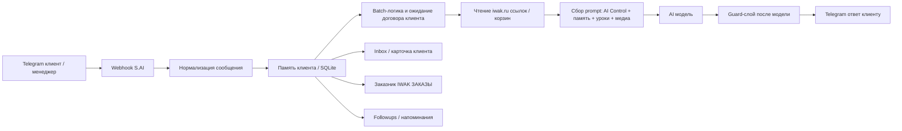
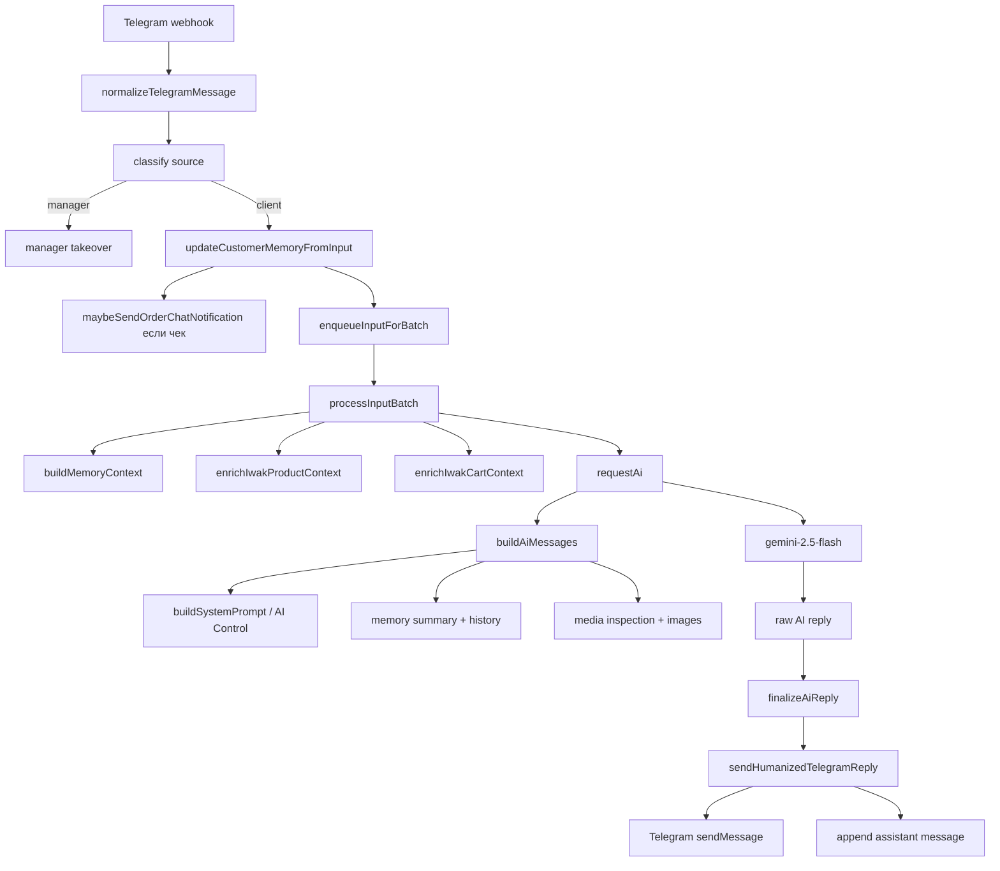

# S.AI IWAK: полный аудит архитектуры

Дата аудита: 06.05.2026  
Режим аудита: read-only, без изменения логики и без вмешательства в живых клиентов  
Живой сервер: `/root/sai` на `134.17.17.174`  
Живой коммит: `7a70ad7 Trim robotic media replies`

## 1. Что такое S.AI

S.AI сейчас уже не просто "Telegram -> AI -> Telegram". Фактически это единая система продаж IWAK:



S.AI предназначен для:

- принимать сообщения из Telegram Business;
- отличать клиента, менеджера, авто-сообщения и самого бота;
- вести диалог как продавец IWAK;
- помнить клиента, заказ, размер, телефон, город, товар, оплату;
- читать товарные ссылки и корзины `iwak.ru`;
- работать с фото, PDF, голосовыми и другими вложениями;
- строить AI prompt из AI Control, памяти и уроков;
- отправлять ответ только после защитных проверок;
- не мешать менеджеру, если менеджер перехватил диалог;
- отправлять заказ в группу заказника после чека;
- показывать клиентов, статусы и память в веб-интерфейсе;
- готовить follow-up тексты, если включить этот режим.

## 2. Файлы системы

Основные файлы:

- `index.js` - главное ядро сервера, Telegram, AI, prompt, guards, заказник, followups, веб API.
- `src/customer-store.js` - SQLite база клиентов, сообщений, фактов, заказов, followups.
- `public/index.html` - веб-интерфейс S.AI Control.
- `public/login.html` - экран входа.
- `package.json` - зависимости и команды.
- `ecosystem.config.cjs` - PM2 запуск процесса `sai`.
- `data/runtime-config.json` - живые настройки AI Control и интеграций на сервере.
- `data/customers.sqlite` - единая база клиентов.
- `data/training-examples.json` - уроки обучения.
- `data/memory.json` - legacy память, сейчас запасной слой.
- `logs/runtime.jsonl` - runtime логи.

Важно: `README.md` устарел. Там написано "No database", но сейчас база есть и она основная.

## 3. Живой runtime на сервере

Проверено на сервере:

- клиентская модель: `gemini-2.5-flash`;
- AI base URL: `https://api.aitunnel.ru/v1/`;
- STT модель: `gemini-2.5-flash`;
- S.AI GPT модель: `gpt-5-mini`;
- автоответ клиенту: включен;
- память: включена;
- менеджерский перехват: включен;
- заказник: включен;
- order chat id: `-5043971314`;
- оплата: включена;
- доставка: включена;
- media behavior: `answer_from_media`;
- тон: `concise`;
- длина ответа: `short`;
- стиль продавца: `calm`;
- возрастной ритм: `27`;
- batch debounce: `3000 ms`;
- listen wait debounce: `45000 ms`;
- listen wait max window: `90000 ms`;
- manager return delay: `60000 ms`;
- followup master: выключен;
- followup worker: выключен.

## 4. Входящее сообщение: первая точка

Главная точка входа:

`POST /api/telegram/webhook`

Кодовая зона: `index.js`, функция webhook внизу файла.

Что происходит:

1. Telegram отправляет update.
2. S.AI определяет, есть ли там сообщение.
3. Если это `business_connection`, S.AI сохраняет связь Telegram Business.
4. Если это сообщение, S.AI сразу отвечает Telegram `200 OK`.
5. Дальше обработка идет асинхронно через `setImmediate`, чтобы Telegram не ждал.

Ключевой смысл: Telegram получает быстрый `200`, а вся тяжелая логика идет после.

## 5. Типы Telegram update

Функция `getTelegramMessageContext` разбирает:

- `business_message`;
- `edited_business_message`;
- обычный `message`;
- `edited_message`;
- `channel_post`;
- `edited_channel_post`;
- `business_connection`.

Для IWAK главный сценарий - `business_message`, потому что бот работает в Telegram Business-чате.

## 6. Кто написал сообщение

Функция `classifyTelegramMessageSource` классифицирует источник:

- `client` - клиент;
- `manager` - человек-менеджер;
- `manager_auto` - авто-сообщение менеджера/offline;
- `bot` - сообщение самого бота.

Это критично. Если пишет менеджер, AI не должен влезать.

Логика:

- если нет business connection - обычно это клиент;
- если есть `sender_business_bot` - это бот;
- если `from.id` совпадает с владельцем business connection - это менеджер;
- если `from.id` отличается от `chat.id` и business user неизвестен - тоже считается менеджером.

## 7. Нормализация сообщения

Функция `normalizeTelegramMessage` превращает любое Telegram-сообщение в единый input:

```js
{
  text,
  images,
  media,
  messageType,
  hasMedia,
  hasLinkInput
}
```

Поддерживается:

- текст;
- caption;
- фото;
- image document;
- PDF;
- voice;
- video;
- video_note;
- sticker;
- contact;
- location;
- venue;
- poll;
- generic document.

### Фото

Берется самое большое фото из массива Telegram `message.photo`.

S.AI:

- сохраняет file id;
- получает URL файла через Telegram API;
- добавляет URL в `images`, чтобы vision-модель могла его видеть.

### Фото товара из iwak.ru Reader

Если клиент присылает ссылку `iwak.ru/product` или `iwak.ru/cart`, слой `iwak.ru Reader` читает карточку товара через product API.

S.AI:

- берет из карточки название, бренд, категорию, цвет, цену, размеры и фото;
- добавляет краткий текстовый контекст в память текущего ответа;
- добавляет до 2 фото товара в `iwakReaderImages`, чтобы продавец видел товар глазами, а не только строкой API;
- не смешивает эти фото с фактом “клиент прислал медиа”: это фото карточки товара, а не вложение клиента.

### PDF

PDF обрабатывается отдельно:

- пробует извлечь текстовый слой;
- если нужно, рендерит первую страницу в картинку;
- добавляет текстовое описание для модели;
- если PDF похож на чек, дает модели инструкцию сверить чек, но не подтверждать оплату финально.

### Голосовые

Voice и video_note идут через STT:

- скачивается Telegram file;
- отправляется в STT backend;
- результат становится `text`.

## 8. Логирование входа

После нормализации пишется событие `IN`:

- traceId;
- userId;
- chatId;
- updateType;
- businessConnectionId;
- messageSource;
- messageId;
- имя;
- username;
- тип сообщения;
- текст;
- количество изображений;
- hasMedia;
- hasLinkInput.

`traceId` - это нить, по которой потом можно собрать весь путь одного ответа.

## 9. Игнор заказника

Если сообщение пришло из группы заказника, S.AI его игнорирует:

```text
messageStatus: order_chat_ignored
```

Это нужно, чтобы бот не отвечал в группе `IWAK ЗАКАЗЫ`.

## 10. Память клиента

Сейчас основная память - SQLite в `src/customer-store.js`.

Главные таблицы:

- `customers`;
- `messages`;
- `customer_facts`;
- `dialog_states`;
- `orders`;
- `business_connections`;
- `followup_jobs`;
- `followup_events`.

Схема сейчас версии `7`.

SQLite включен в WAL-режиме:

```js
db.pragma('journal_mode = WAL');
db.pragma('foreign_keys = ON');
```

Это нормальная архитектура для 1000+ клиентов на одном Node-процессе.

## 11. Таблица customers

Хранит клиента:

- внутренний id;
- telegram_user_id;
- telegram_chat_id;
- username;
- first_name;
- last_name;
- phone;
- created_at;
- updated_at;
- last_seen_at.

Ключевая защита: если сообщение от менеджера/бота, identity клиента не перетирается.

## 12. Таблица messages

Хранит историю:

- customer_id;
- telegram_message_id;
- role;
- text;
- message_type;
- media_json;
- trace_id;
- created_at.

Роли:

- `user`;
- `assistant`;
- `manager`;
- иногда технические варианты.

Есть защита от дублей:

- для входящих по `telegram_message_id`;
- для assistant по `trace_id`.

## 13. Таблица customer_facts

Это факты, которые S.AI вытащил из диалога:

- размер;
- стелька;
- ФИО;
- телефон;
- город;
- адрес;
- ПВЗ;
- служба доставки;
- товар;
- цена;
- текущая корзина;
- ссылка товара;
- статус оплаты;
- интерес клиента.

Факт хранит:

- key;
- value;
- confidence;
- source;
- updated_at.

## 14. Таблица dialog_states

Хранит состояние диалога:

- stage;
- ai_mode;
- manager_active_at;
- manager_last_message_at;
- pending_since;
- auto_takeover_at;
- last_client_trace_id;
- order chat pending/sent защита от дублей.

Особенно важное поле: `ai_mode`.

Возможные смыслы:

- `active` - AI может отвечать;
- `passive_manager` - менеджер ведет вручную, AI ждет.

## 15. Таблица orders

Хранит последний заказ клиента:

- product;
- size;
- price;
- full_name;
- phone;
- delivery_address;
- status;
- payment_status;
- payment_check_status;
- payment_check_summary;
- proof_received_at.

Сейчас это не полноценная CRM-таблица заказов с позициями, а последняя/текущая сущность заказа.

## 16. Legacy memory

Есть старый файл:

`data/memory.json`

Сейчас он запасной. При старте SQLite импортирует legacy memory, но основным источником должна быть SQLite.

Функции `shouldUseLegacyMemoryFallback` и `shouldWriteLegacyMemory` оставляют совместимость.

## 17. Обновление памяти из сообщения

Функция `updateCustomerMemoryFromInput` вытаскивает из текста:

- телефон;
- размер;
- стельку;
- город;
- ФИО;
- адрес доставки;
- службу доставки;
- ПВЗ;
- товар;
- цену;
- признаки оплаты;
- чек;
- стадию диалога.

Проблемная зона: извлечение фактов regex-ами. Это быстро, но иногда может схватить мусор, если текст похож на адрес/товар/доставку.

## 18. Менеджерский перехват

Если пишет менеджер:

1. Сообщение сохраняется как `manager`.
2. Применяются manager hints через `applyManagerStageHints`.
3. Если перехват включен, S.AI:
   - отменяет batch клиента;
   - отменяет timer возврата AI;
   - ставит `aiMode = passive_manager`;
   - пишет статус `manager_takeover`;
   - не отвечает клиенту.

Если клиент потом пишет, пока менеджер ведет, S.AI не отвечает сразу, а ставит pending и может вернуться через `manager_return_delay_ms`.

На живом сервере задержка возврата: `60000 ms`.

## 19. Batch-логика

S.AI не всегда отвечает на каждое сообщение мгновенно. Входы собираются в batch:

- `enqueueInputForBatch`;
- `flushChatBatch`;
- `buildBatchInput`.

Зачем:

- клиент часто пишет мысль в 2-3 сообщениях;
- фото может прийти отдельно от текста;
- “сейчас скину” нужно дождаться;
- заказные данные могут прийти частями.

На живом сервере:

- обычный debounce: `3000 ms`;
- listen wait debounce: `45000 ms`;
- max wait window: `90000 ms`.

## 20. Semantic merge

Есть логика, которая решает, надо ли объединять сообщения:

- `getSemanticMergeInfo`;
- `batchNeedsSemanticMerge`;
- `batchNeedsPendingPayloadContext`;
- `batchNeedsOrderContextMerge`;
- `absorbPendingOrderContextInputs`.

Она нужна для случаев:

- клиент сначала отправил ссылку, потом размер;
- “сейчас скину модель”, потом ссылка;
- клиент прислал готовый заказ;
- короткое сообщение является продолжением прошлого.

## 21. Чтение iwak.ru

Ссылки `iwak.ru/product/...` и `iwak.ru/cart?...` обрабатываются до запроса к модели.

Функции:

- `extractIwakProductLinks`;
- `getIwakProductIdFromLink`;
- `fetchIwakProduct`;
- `enrichIwakProductContext`;
- `extractIwakCartLinks`;
- `parseIwakCartItems`;
- `enrichIwakCartContext`.

S.AI достает product id из URL:

```text
https://iwak.ru/product/nike-air-jordan-1-low-se-278
```

id = `278`.

Дальше идет запрос к API товара, и факты попадают в memory context.

## 22. Product/cart context

Если товар прочитан, S.AI собирает:

- название;
- цену;
- размер из корзины;
- ссылку;
- orderDetails.

Потом:

- `appendProductContextToMemory`;
- `appendCartContextToMemory`.

Это пишет факты:

- `currentProduct`;
- `currentProductLink`;
- `currentCart`;
- `currentCartLink`;
- order draft.

## 23. Заказник IWAK ЗАКАЗЫ

Заказник отправляется не на каждый заказный диалог, а после чека/оплаты.

Функция:

`maybeSendOrderChatNotification`

Условия:

- order chat включен;
- сообщение не из order chat;
- вход похож на чек/квитанцию/оплату;
- нет дубля по receiptKey/digest.

Сообщение собирает:

- дату/время МСК;
- клиента;
- товар;
- ссылку;
- размер;
- стельку;
- ФИО;
- телефон;
- город;
- доставку.

Функция:

`buildOrderChatMessage`

Есть защита от дублей:

- `orderChatPendingReceiptKey`;
- `orderChatPendingDigest`;
- `lastOrderChatReceiptKey`;
- `lastOrderChatDigest`;
- временные окна pending 2 минуты и recent 10 минут.

## 24. AI Control

AI Control не является всей системой. Это слой, который строит system prompt для модели.

Функция:

`buildSystemPrompt`

В prompt попадает:

- время и приветствие;
- тон;
- длина ответа;
- персона;
- media behavior;
- ядро IWAK;
- границы фактов;
- живость общения;
- путь заказа;
- проверка ответа;
- проверка чека;
- качество/возвраты;
- магазин/доверие;
- контакты;
- уроки;
- общая инструкция;
- оплата;
- доставка;
- примеры диалогов.

## 25. Закон паспорта AI Control

AI Control должен быть не декоративной страницей, а техпаспортом S.AI.

Правило проекта:

1. Если настройка, правило, prompt, guard, шаблон, режим, лимит или схема влияет на ответ AI, заказник, память, доставку, оплату, медиа, менеджерский перехват или followup - это должно быть видно в панели.
2. Если это можно менять безопасно без перезапуска - это должно редактироваться из панели.
3. Если это нельзя менять безопасно live - это всё равно должно быть видно как read-only с причиной.
4. Новые скрытые правила в коде запрещены: при добавлении `runtimeConfig`, default-rule, guard или template нужно сразу добавить отображение в паспорт AI Control.
5. Пустой блок не считается прозрачностью. Если поле optional, интерфейс должен показывать понятный маркер вроде `не задано`, а не молча оставлять пустоту.

Текущий механизм:

- `GET /config/status` отдаёт живой runtime-снимок;
- AI Control показывает ручные узлы карты;
- AI Control показывает полный техпаспорт всех runtime-полей;
- сохранение идёт через `POST /config`;
- `buildSystemPrompt` должен брать правила из runtime snapshot, а не из невидимых prompt-слоёв.

## 26. Уроки обучения

Файл:

`data/training-examples.json`

API:

- `GET /training`;
- `POST /training`;
- `PATCH /training/:id`;
- `DELETE /training/:id`;
- `POST /training/explain`;
- `POST /training/coach`.

Уроки бывают:

- good;
- bad.

Подбор:

- `selectTrainingExamples`;
- score по тексту клиента, памяти и истории;
- максимум в prompt сейчас ограничен.

Смысл:

- bad уроки запрещают повторять ошибку;
- good уроки дают эталон поведения.

## 27. Prompt для модели

Функция:

`buildAiMessages`

В модель отправляется массив messages:

1. `system` - AI Control system prompt.
2. `system` - memory summary клиента, если есть.
3. История диалога из памяти.
4. `user` - текущий текст + media inspection text + изображения.

То есть фактический prompt шире, чем поле AI Control Preview.

## 28. Media inspection text

Если есть медиа, в user-текст добавляется скрытая инструкция:

- посмотреть каждое изображение;
- классифицировать: товар, корзина, ПВЗ, чек, другое;
- не считать любое фото чеком;
- если бирка с EU-размером и клиент говорит, что подошло, подтвердить размер и дать см;
- не писать канцелярское "на изображении видно".

Это не отдельное поле в AI Control, но сильно влияет на ответы.

## 29. AI request

Функция:

`requestAi`

Проверяет:

- есть ли `ai_key`;
- есть ли `ai_url`;
- есть ли `model`.

Дальше:

- ждет свободный слот AI;
- строит messages;
- делает POST на `/chat/completions`;
- передает model, messages, temperature;
- парсит ответ;
- пишет `AI_REQUEST`, `AI_REPLY`, `AI_DECISION_TRACE`.

Живая модель клиента:

`gemini-2.5-flash`

Живой endpoint:

`https://api.aitunnel.ru/v1/chat/completions`

## 30. Ограничение параллельности AI

Есть `AI_CONCURRENCY_LIMIT`.

Перед запросом вызывается:

`waitForSlot('ai', ...)`

Если слот не получен, ответ пропускается и пишется ошибка `ai.wait_timeout`.

Это защищает от одновременной лавины запросов.

## 31. AI decision trace

Функции:

- `buildAiDecisionTrace`;
- `logAiDecisionTrace`.

Trace хранит:

- system prompt preview;
- memory summary preview;
- selectedTraining;
- appliedControls;
- rawAiReply;
- finalReply;
- было ли изменение finalize;
- статус: ok/skipped/error.

Это главный инструмент для ответа на вопрос "почему он так ответил".

## 32. Guard-слой после модели

Самый важный скрытый слой:

`finalizeAiReply`

Он получает сырой ответ модели и может заменить/исправить его до отправки клиенту.

Последовательность:

1. force receipt acknowledgement;
2. media receipt acknowledgement;
3. stale receipt fallback;
4. wait customer continuation;
5. time-aware greeting;
6. repeated greeting strip;
7. cart switch;
8. delivery choice;
9. delivery tracking;
10. delivery cost;
11. payment amount;
12. product media cleanup;
13. shoe size/insole;
14. availability issue;
15. photo size reality;
16. delivery fitting;
17. return conditions;
18. store offline;
19. early order contact request;
20. bot identity;
21. order form compacting;
22. catalog promise cleanup.

Это не AI Control. Это железная логика кода.

## 33. Приветствие по времени

Функции:

- `getMskDateParts`;
- `getTimeAwareGreeting`;
- `getTimeGuidance`;
- `finalizeTimeAwareGreetingReply`;
- `finalizeRepeatedGreetingReply`.

Правила:

- 05:00-11:59 - `Доброе утро`;
- 12:00-17:59 - `Добрый день`;
- 18:00-04:59 - `Добрый вечер`;
- если диалог уже начат, приветствие срезается.

Важный нюанс: это работает для ответа AI, а не меняет текст клиента. Если модель не здоровается в первом ответе и ответ не начинается с приветствия, guard может добавить приветствие только в сценарии начального greeting.

## 34. Чеки

Если вход считается платежным доказательством:

`shouldForceReceiptAcknowledgement`

Ответ принудительно:

`Чек получил, спасибо.`

Даже если модель написала длиннее, guard заменит.

Если модель написала "чек получил" на не-чек, `getStaleReceiptAckFallback` пытается заменить на нейтральный ответ.

## 35. Доставка

Доставка управляется двумя слоями:

1. AI Control prompt:
   - `delivery_rules_text`;
   - `delivery_tracking_text`;
   - style/layout/example.

2. Guard-функции:
   - `finalizeDeliveryChoiceReply`;
   - `finalizeDeliveryTrackingReply`;
   - `finalizeDeliveryCostReply`;
   - `finalizeDeliveryFittingReply`.

Живое правило:

- Яндекс Доставка и Ozon бесплатные;
- остальные транспортные компании платно по тарифам компаний.

## 36. Возвраты и примерка

Возврат управляется:

- `quality_return_text`;
- `quality_rules_text`;
- `RETURN_CONDITION_RULE_TEXT`;
- `finalizeDeliveryFittingReply`;
- `finalizeReturnConditionReply`.

Смысл:

- при получении можно забрать, примерить, осмотреть, проверить;
- если не подошло, написать нам;
- возврат/обмен по правилам магазина;
- товарный вид должен быть сохранен;
- упаковка целая;
- комплект полный;
- нет следов носки/использования;
- подошва чистая;
- без повреждений.

## 37. Размеры и стелька

Есть несколько слоев:

- извлечение размера: `extractSize`, `extractShoeSize`;
- извлечение стельки: `extractInsoleCm`;
- проверка диапазона: `getShoeSizeInsoleIssue`;
- guard: `finalizeShoeSizeInsoleReply`;
- заказник: `getApproxInsoleBySize`.

Для заказника таблица:

- 41 -> 26;
- 42 -> 26.5;
- 43 -> 27.2;
- 44 -> 28;
- 45 -> 29;
- 46 -> 29.5.

## 38. Оплата

Оплата управляется:

- `payment_enabled`;
- `payment_method`;
- `payment_card_number`;
- `payment_recipient_name`;
- `payment_bank`;
- `payment_comment`;
- payment style/layout/example;
- `finalizePaymentAmountReply`.

Guard пытается добавить сумму, если модель отправляет реквизиты без суммы, а цена известна из заказа/корзины.

## 39. Отправка ответа

После finalize:

1. Проверяется менеджерский перехват еще раз.
2. Ответ отправляется через `sendHumanizedTelegramReply`.
3. Ответ может быть разбит на части через `splitReplyForTelegram`.
4. Перед каждой частью отправляется `typing`.
5. Ждет человекоподобную задержку.
6. Если клиент успел написать новое сообщение, отправка отменяется.
7. Сообщение отправляется в Telegram через `sendMessage`.
8. Ответ пишется в память как `assistant`.
9. `aiMode` ставится `active`.

## 40. Telegram send

Функция:

`sendTelegramMessage`

Отправляет:

- `chat_id`;
- `text`;
- `parse_mode: HTML`;
- `disable_web_page_preview: true`;
- `business_connection_id`, если есть;
- `reply_to_message_id`, если выбран reply mode.

Если Telegram не принимает reply-to, S.AI повторяет отправку без reply.

## 41. Web-интерфейс

`public/index.html` содержит:

- AI Control;
- S.AI GPT;
- Integrations;
- Logs;
- Training;
- Inbox.

Основные API:

- `/config/status`;
- `/config`;
- `/logs`;
- `/training`;
- `/inbox`;
- `/memory/:chatId`;
- `/followups`.

## 42. AI Control UI

Секции AI Control:

- Ядро IWAK;
- Границы фактов;
- Магазин и доверие;
- Контакты;
- Живость общения;
- Путь заказа;
- Проверка ответа;
- Проверка чека;
- Оплата;
- Доставка;
- Товар/качество/возвраты;
- Примеры диалогов;
- Preview итогового prompt.

Проблема UX: пустые textarea выглядят как пустой prompt, хотя на самом деле работают встроенные правила.

## 43. Inbox

Inbox строится через:

`buildInboxPayload`

Для каждого клиента считает:

- статус;
- деньги;
- последний заказ;
- последние сообщения;
- followup;
- открытый followup job.

Статусы:

- manager;
- closed;
- paid;
- waiting_receipt;
- promised_later;
- waiting_payment;
- waiting_data;
- choosing;
- new.

## 44. Followups

Followups сейчас на сервере выключены как автоматика.

Но код есть:

- подготовка черновика;
- safety checks;
- тихие часы;
- лимит касаний;
- дневной лимит;
- ручная отправка;
- автоотправка, если включить.

Главный тумблер сейчас выключен, поэтому оно не должно само писать клиентам.

## 45. S.AI Штурман

S.AI Штурман - внутренний помощник владельца внутри панели.

Модель:

использует общую главную модель из `Integrations -> AI Provider`.
Отдельной модели у Штурмана нет.

Он умеет:

- смотреть проект;
- искать по логам;
- смотреть inbox;
- анализировать prompt;
- анализировать Prompt Trace и открытый узел карты;
- предлагать уроки;
- готовить безопасные pending actions после подтверждения владельца.

Это не клиентский продавец. Это внутренний помощник для управления S.AI.
Он не отправляет сообщения клиентам и не делает скрытых правок.

## 46. Логи

Runtime события:

- `IN`;
- `BATCH`;
- `AI_REQUEST`;
- `AI_REPLY`;
- `AI_DECISION_TRACE`;
- `TG_ACTION`;
- `TG_SEND`;
- `MESSAGE_STATUS`;
- `ORDER_CHAT`;
- `TRAINING_EXAMPLE`;
- `FOLLOWUP_*`;
- `ERROR`.

Логи идут в:

`logs/runtime.jsonl`

И в оперативный массив runtime logs.

## 47. Текущая сильная архитектура

Что уже хорошо:

- единая SQLite база;
- WAL mode;
- индексы v7;
- защита identity клиента от менеджера;
- dedupe сообщений;
- order chat dedupe;
- manager takeover;
- product/cart reader;
- AI Control как управляемый слой;
- post-AI guards;
- traceId по всей цепочке;
- Inbox и memory UI.

## 48. Текущие слабые места

1. `index.js` слишком большой.
   Почти вся система в одном файле на 10.9k строк.

2. README устарел.
   Он описывает старую простую систему без базы.

3. AI Control UI непрозрачен.
   Пустые поля выглядят как пустые правила, хотя правила активны.

4. Prompt preview не показывает весь фактический runtime prompt.
   Он показывает AI Control prompt, но не весь контекст конкретного клиента: память, историю, media inspection, product/cart context.

5. Regex-память может загрязняться.
   Извлечение товаров/адресов/доставки regex-ами иногда может брать не то.

6. Заказ `orders` сейчас скорее "текущий/последний заказ", а не полноценная таблица order items.

7. Guard-логика сильная, но скрытая.
   Пользователь не видит, что ответ изменился после модели.

8. Product reader зависит от доступности iwak API.
   Если API не ответил, модель может опираться на старую память или текст клиента.

9. Followups есть, но статусы могут казаться активными в UI даже при выключенном master.

## 49. Главная карта ответственности



## 50. Самое важное понимание

S.AI сейчас состоит из пяти мозгов:

1. **AI Control** - говорит модели, как себя вести.
2. **Память/SQLite** - говорит, что уже известно про клиента.
3. **Reader iwak.ru** - говорит, что реально в товаре/корзине.
4. **Lessons** - говорят, какие ошибки/удачные ответы учитывать.
5. **Guard-код** - железно исправляет ответ после модели.

Если ответ плохой, причина может быть не только в prompt. Она может быть в:

- грязной памяти;
- неверно извлеченном факте;
- не прочитанной ссылке;
- старом уроке;
- модели;
- guard-слое;
- manager takeover;
- batch-склейке;
- Telegram source classification.

Поэтому отладка должна всегда идти по traceId:

`IN -> MEMORY -> BATCH -> PRODUCT/CART -> AI_REQUEST -> AI_REPLY -> FINALIZE -> TG_SEND`
